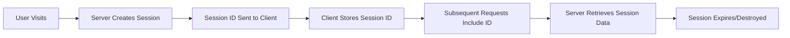

# 📚 Comprehensive Guide to Cookies & Sessions

## 📖 Table of Contents
1. [Fundamental Concepts](#fundamental-concepts)
2. [Cookies Deep Dive](#cookies-deep-dive)
3. [Sessions Deep Dive](#sessions-deep-dive)
4. [When to Use Cookies vs Sessions](#when-to-use-cookies-vs-sessions)
5. [Security Considerations](#security-considerations)
6. [Real-World Use Cases](#real-world-use-cases)
7. [Best Practices](#best-practices)
8. [Advanced Topics](#advanced-topics)
9. [Performance Considerations](#performance-considerations)
10. [Troubleshooting](#troubleshooting)

---

## Fundamental Concepts

### The Problem: HTTP is Stateless
HTTP is a **stateless protocol** - each request is independent and doesn't remember previous interactions. But web applications need to:
- Remember user login status
- Keep shopping cart items
- Store user preferences
- Track user sessions

**Solution**: Cookies and Sessions provide state management for web applications.

### Key Definitions

| Term | Definition | Location |
|------|------------|----------|
| **Cookie** | Small text file stored on client (browser) | Client-side |
| **Session** | Data stored on server, identified by session ID | Server-side |
| **Session ID** | Unique identifier linking client to server data | Both (ID in cookie, data on server) |
| **State** | Information about user's current interaction | Varies |

---

## Cookies Deep Dive

### What Are Cookies?
Cookies are small pieces of data (max 4KB) that:
- Are stored by the browser
- Are automatically sent with every HTTP request to the domain
- Can persist across browser sessions
- Are accessible to JavaScript (unless httpOnly)

### Cookie Structure
```
Set-Cookie: name=value; expires=date; domain=domain; path=path; secure; httpOnly; sameSite=strict
```

### Cookie Attributes

#### 📅 **Expiration Control**
```javascript
// Session cookie (deleted when browser closes)
response.cookie('temp', 'value')

// Persistent cookie with expiry date
response.cookie('persistent', 'value', {
  expires: new Date('2024-12-31')
})

// Max age (more reliable than expires)
response.cookie('maxage', 'value', {
  maxAge: '7d'  // 7 days
})
```

#### 🌐 **Domain & Path Control**
```javascript
// Available to all subdomains
response.cookie('name', 'value', {
  domain: '.example.com'  // *.example.com
})

// Available only to specific path
response.cookie('admin', 'token', {
  path: '/admin'  // Only sent to /admin/* routes
})
```

#### 🔒 **Security Attributes**

##### **httpOnly** - XSS Protection
```javascript
// ❌ Vulnerable to XSS
response.cookie('token', 'abc123', { httpOnly: false })
// JavaScript can access: document.cookie

// ✅ Protected from XSS
response.cookie('token', 'abc123', { httpOnly: true })
// JavaScript cannot access this cookie
```

##### **secure** - HTTPS Only
```javascript
// ❌ Sent over HTTP and HTTPS
response.cookie('sensitive', 'data', { secure: false })

// ✅ HTTPS only
response.cookie('sensitive', 'data', { secure: true })
```

##### **sameSite** - CSRF Protection
```javascript
// Strictest - never sent cross-site
response.cookie('csrf', 'token', { sameSite: 'strict' })

// Moderate - sent on top-level navigation
response.cookie('auth', 'token', { sameSite: 'lax' })

// Permissive - always sent (requires secure)
response.cookie('tracking', 'id', { 
  sameSite: 'none', 
  secure: true 
})
```

### Cookie Limitations

| Limitation | Details | Impact |
|------------|---------|---------|
| **Size** | 4KB max per cookie | Can't store large data |
| **Number** | ~50-300 per domain | Finite storage |
| **Performance** | Sent with every request | Network overhead |
| **Security** | Client-side storage | Can be tampered with |

---

## Sessions Deep Dive

### What Are Sessions?
Sessions are server-side storage mechanism that:
- Store data on the server (file, memory, database)
- Use a session ID to identify user data
- Provide secure, unlimited storage
- Are not directly accessible by client

### Session Lifecycle



### Session Storage Options

#### 1. **Memory Storage**
```javascript
// config/session.ts
{
  driver: 'memory'
}
```
- ✅ Fastest
- ❌ Lost on server restart
- ❌ Doesn't scale across servers

#### 2. **File Storage**
```javascript
// config/session.ts  
{
  driver: 'file',
  file: {
    location: 'tmp/sessions'
  }
}
```
- ✅ Persistent across restarts
- ✅ Simple setup
- ❌ File I/O overhead
- ❌ Doesn't scale across servers

#### 3. **Database Storage**
```javascript
// config/session.ts
{
  driver: 'database',
  table: 'sessions'
}
```
- ✅ Persistent and scalable
- ✅ Works with multiple servers
- ✅ Can be backed up
- ❌ Database overhead

#### 4. **Redis Storage** (Recommended for Production)
```javascript
// config/session.ts
{
  driver: 'redis',
  redisConnection: 'local'
}
```
- ✅ Fast and persistent
- ✅ Scales horizontally
- ✅ Built-in expiration
- ✅ High performance

### Session Operations

#### Basic Operations
```javascript
// Store data
session.put('user_id', 123)
session.put('user', { name: 'John', email: 'john@example.com' })

// Retrieve data
const userId = session.get('user_id')
const user = session.get('user')
const theme = session.get('theme', 'light') // with default

// Check existence
if (session.has('user_id')) {
  // User is logged in
}

// Remove data
session.forget('temp_data')

// Clear all data
session.clear()
```

#### Flash Messages (One-time Data)
```javascript
// Set flash message
session.flash('success', 'Profile updated!')
session.flash('errors', ['Email required', 'Password too short'])

// Read flash message (auto-deleted after reading)
const message = session.flashMessages.get('success')
const errors = session.flashMessages.get('errors')
```

#### Security Operations
```javascript
// Regenerate session ID (after login)
await session.regenerate()

// Get current session ID
const sessionId = session.sessionId
```

---

## When to Use Cookies vs Sessions

### 🍪 Use Cookies For:

#### ✅ **User Preferences**
```javascript
// Theme preference
response.cookie('theme', 'dark', {
  maxAge: '365d',
  httpOnly: false  // Allow JavaScript access
})

// Language setting
response.cookie('language', 'en', { maxAge: '1y' })
```

#### ✅ **Non-Sensitive Tracking**
```javascript
// Analytics data
response.cookie('visit_count', '5', { maxAge: '30d' })
response.cookie('last_visit', '2024-01-15', { maxAge: '30d' })
```

#### ✅ **Small Persistent Data**
```javascript
// Recently viewed items (IDs only)
response.cookie('recent_items', '[1,2,3]', { maxAge: '7d' })
```

#### ✅ **Cross-Session Persistence**
```javascript
// Remember me functionality
response.cookie('remember_token', 'encrypted_token', {
  maxAge: '30d',
  httpOnly: true,
  secure: true
})
```

### 💾 Use Sessions For:

#### ✅ **Authentication State**
```javascript
// After successful login
session.put('user_id', user.id)
session.put('user_role', user.role)
session.put('login_time', new Date())
await session.regenerate() // Security best practice
```

#### ✅ **Sensitive Data**
```javascript
// User profile data
session.put('user', {
  id: 123,
  name: 'John Doe',
  email: 'john@example.com',
  permissions: ['read', 'write', 'admin']
})
```

#### ✅ **Large Datasets**
```javascript
// Complex shopping cart
session.put('cart', {
  items: [
    {
      id: 1,
      name: 'Laptop',
      price: 999.99,
      quantity: 1,
      options: { color: 'silver', warranty: '2-year' }
    }
  ],
  shipping: { method: 'express', cost: 25.00 },
  tax: 89.99,
  total: 1114.98
})
```

#### ✅ **Temporary Data**
```javascript
// Multi-step form data
session.put('checkout_step_1', formData1)
session.put('checkout_step_2', formData2)

// Flash messages
session.flash('success', 'Order placed successfully!')
```

#### ✅ **Server-Side Processing**
```javascript
// File upload progress
session.put('upload_progress', {
  fileId: 'abc123',
  progress: 75,
  status: 'uploading'
})
```

---

## Security Considerations

### 🍪 Cookie Security

#### **XSS (Cross-Site Scripting) Protection**
```javascript
// ❌ Vulnerable
response.cookie('auth_token', token, { httpOnly: false })
// Attacker can steal: document.cookie

// ✅ Protected  
response.cookie('auth_token', token, { httpOnly: true })
// JavaScript cannot access
```

#### **CSRF (Cross-Site Request Forgery) Protection**
```javascript
// ✅ CSRF Token
response.cookie('csrf_token', generateToken(), {
  sameSite: 'strict',
  secure: true
})
```

#### **Cookie Signing & Encryption**
```javascript
// Signed cookie (integrity verification)
response.cookie('data', value, { signed: true })

// Encrypted cookie (AdonisJS automatically encrypts)
response.encryptedCookie('sensitive', secretData)
```

### 💾 Session Security

#### **Session Fixation Prevention**
```javascript
// ❌ Vulnerable - keeping same session ID
session.put('user_id', user.id)

// ✅ Protected - regenerate ID after login
session.put('user_id', user.id)
await session.regenerate()
```

#### **Session Timeout**
```javascript
// config/session.ts
{
  age: '2h',           // Auto-expire after 2 hours
  clearWithBrowser: true  // Clear when browser closes
}
```

#### **Secure Session Storage**
```javascript
// ✅ Production setup
{
  driver: 'redis',
  cookie: {
    httpOnly: true,
    secure: true,      // HTTPS only
    sameSite: 'strict'
  }
}
```

---

## Real-World Use Cases

### 🛒 **E-Commerce Platform**

#### Shopping Cart Implementation
```javascript
// Hybrid approach - best of both worlds
class ShoppingCartService {
  
  // Guest user - cookie-based cart
  addToGuestCart(request, response, item) {
    const cart = JSON.parse(request.cookie('cart', '[]'))
    cart.push(item)
    
    response.cookie('cart', JSON.stringify(cart), {
      maxAge: '30d',
      httpOnly: false  // Allow frontend updates
    })
  }
  
  // Logged-in user - session-based cart  
  addToUserCart(session, item) {
    const cart = session.get('cart', [])
    cart.push({
      ...item,
      addedAt: new Date(),
      userId: session.get('user_id')
    })
    session.put('cart', cart)
  }
  
  // Merge carts on login
  async mergeCartsOnLogin(request, session) {
    const guestCart = JSON.parse(request.cookie('cart', '[]'))
    const userCart = session.get('cart', [])
    
    const mergedCart = [...userCart, ...guestCart]
    session.put('cart', mergedCart)
    
    // Clear guest cart cookie
    response.clearCookie('cart')
  }
}
```

### 🔐 **Authentication System**

#### Complete Auth Flow
```javascript
class AuthService {
  
  async login(email, password, session, response) {
    const user = await this.validateCredentials(email, password)
    
    if (!user) {
      session.flash('error', 'Invalid credentials')
      return false
    }
    
    // Store in session (secure)
    session.put('user_id', user.id)
    session.put('user_role', user.role)
    session.put('login_time', new Date())
    
    // Regenerate session ID (security)
    await session.regenerate()
    
    // Remember me cookie (if requested)
    if (rememberMe) {
      const rememberToken = await this.generateRememberToken(user)
      response.cookie('remember_token', rememberToken, {
        maxAge: '30d',
        httpOnly: true,
        secure: true,
        signed: true
      })
    }
    
    // User preferences in cookies
    response.cookie('theme', user.preferences.theme, {
      maxAge: '365d',
      httpOnly: false
    })
    
    session.flash('success', 'Welcome back!')
    return true
  }
  
  async logout(session, response) {
    // Clear session data
    session.forget('user_id')
    session.forget('user_role')
    session.forget('login_time')
    
    // Clear remember me cookie
    response.clearCookie('remember_token')
    
    // Keep user preferences
    // (theme cookie remains)
    
    session.flash('info', 'Successfully logged out')
  }
}
```

### 📊 **Analytics & Tracking**

#### User Behavior Tracking
```javascript
class AnalyticsService {
  
  trackVisit(request, response, session) {
    // Cookie-based tracking (persistent)
    const visitCount = parseInt(request.cookie('visits', '0')) + 1
    const firstVisit = request.cookie('first_visit') || new Date().toISOString()
    
    response.cookie('visits', visitCount.toString(), { maxAge: '365d' })
    response.cookie('first_visit', firstVisit, { maxAge: '365d' })
    response.cookie('last_visit', new Date().toISOString(), { maxAge: '365d' })
    
    // Session-based tracking (current session)
    session.put('session_start', session.get('session_start', new Date()))
    session.put('page_views', session.get('page_views', 0) + 1)
    session.put('current_path', request.url())
  }
  
  trackEvent(session, event, data) {
    const events = session.get('session_events', [])
    events.push({
      event,
      data,
      timestamp: new Date(),
      page: session.get('current_path')
    })
    session.put('session_events', events)
  }
}
```

### 🌐 **Multi-Step Forms**

#### Wizard Form Implementation
```javascript
class WizardFormService {
  
  saveStep(session, step, data) {
    session.put(`wizard_step_${step}`, data)
    session.put('wizard_current_step', step)
    session.put('wizard_updated_at', new Date())
  }
  
  getFormData(session) {
    return {
      step1: session.get('wizard_step_1'),
      step2: session.get('wizard_step_2'),
      step3: session.get('wizard_step_3'),
      currentStep: session.get('wizard_current_step', 1)
    }
  }
  
  completeWizard(session) {
    const formData = this.getFormData(session)
    
    // Process complete form
    const result = this.processForm(formData)
    
    // Clear wizard data
    session.forget('wizard_step_1')
    session.forget('wizard_step_2')
    session.forget('wizard_step_3')
    session.forget('wizard_current_step')
    
    session.flash('success', 'Form submitted successfully!')
    return result
  }
}
```

---

## Best Practices

### 🍪 Cookie Best Practices

#### 1. **Size Management**
```javascript
// ✅ Keep cookies small
response.cookie('theme', 'dark')  // Good: 10 bytes

// ❌ Don't store large data
response.cookie('user_data', JSON.stringify(largeObject))  // Bad: >4KB
```

#### 2. **Security First**
```javascript
// ✅ Secure cookie configuration
const secureDefaults = {
  httpOnly: true,
  secure: process.env.NODE_ENV === 'production',
  sameSite: 'strict',
  path: '/'
}

response.cookie('auth_token', token, secureDefaults)
```

#### 3. **Expiration Strategy**
```javascript
// ✅ Appropriate expiration times
response.cookie('session', 'temp', { maxAge: '2h' })      // Short-lived
response.cookie('preferences', 'dark', { maxAge: '1y' })   // Long-lived  
response.cookie('remember', 'token', { maxAge: '30d' })    // Medium-lived
```

### 💾 Session Best Practices

#### 1. **Session Lifecycle**
```javascript
class SessionManager {
  
  async initializeSession(session) {
    session.put('created_at', new Date())
    session.put('csrf_token', this.generateCSRFToken())
  }
  
  async loginUser(session, user) {
    session.put('user_id', user.id)
    await session.regenerate()  // Always regenerate on login
  }
  
  async cleanupSession(session) {
    // Remove sensitive data but keep flash messages
    session.forget('temp_upload_data')
    session.forget('form_draft')
  }
}
```

#### 2. **Data Organization**
```javascript
// ✅ Structured session data
session.put('user', {
  id: 123,
  role: 'admin',
  permissions: ['read', 'write']
})

session.put('ui_state', {
  sidebar_collapsed: true,
  active_tab: 'dashboard'
})

session.put('temp_data', {
  upload_progress: 75,
  form_draft: {...}
})
```

#### 3. **Error Handling**
```javascript
class SessionService {
  
  safeGet(session, key, defaultValue = null) {
    try {
      return session.get(key, defaultValue)
    } catch (error) {
      console.error(`Session read error for key ${key}:`, error)
      return defaultValue
    }
  }
  
  safeSet(session, key, value) {
    try {
      session.put(key, value)
      return true
    } catch (error) {
      console.error(`Session write error for key ${key}:`, error)
      return false
    }
  }
}
```

### 🏗️ **Architectural Patterns**

#### 1. **Hybrid Storage Strategy**
```javascript
class HybridStorageService {
  
  storeUserData(user, session, response) {
    // Session: Sensitive data
    session.put('user_id', user.id)
    session.put('permissions', user.permissions)
    
    // Cookies: Preferences & UI state
    response.cookie('theme', user.theme, { maxAge: '1y' })
    response.cookie('language', user.language, { maxAge: '1y' })
    response.cookie('timezone', user.timezone, { maxAge: '1y' })
  }
  
  storeShoppingData(cart, session, response) {
    // Session: Full cart data
    session.put('cart', cart)
    
    // Cookie: Cart summary for quick access
    response.cookie('cart_count', cart.items.length.toString(), {
      maxAge: '7d',
      httpOnly: false  // Allow frontend to read
    })
  }
}
```

#### 2. **Progressive Enhancement**
```javascript
class ProgressiveStorageService {
  
  // Start with cookies for guests
  initializeGuestExperience(request, response) {
    response.cookie('visitor_id', this.generateVisitorId(), {
      maxAge: '30d'
    })
  }
  
  // Upgrade to sessions for registered users
  upgradeToUserSession(session, response, userData) {
    // Move cookie data to session
    const visitorData = this.getCookieData(request)
    session.put('visitor_history', visitorData)
    
    // Clear visitor cookies
    response.clearCookie('visitor_id')
    
    // Set up full session
    session.put('user', userData)
  }
}
```

---

## Advanced Topics

### 🔒 **Advanced Security**

#### Content Security Policy (CSP)
```javascript
// Prevent XSS attacks on cookies
response.header('Content-Security-Policy', 
  "default-src 'self'; script-src 'self' 'unsafe-inline'")
```

#### Secure Cookie Flags
```javascript
// Production cookie configuration
const productionCookieConfig = {
  httpOnly: true,
  secure: true,
  sameSite: 'strict',
  domain: process.env.COOKIE_DOMAIN,
  signed: true
}
```

### 🔄 **Session Clustering**

#### Redis Cluster Setup
```javascript
// config/redis.ts
{
  connections: {
    session: {
      host: 'redis-cluster-endpoint',
      port: 6379,
      password: process.env.REDIS_PASSWORD,
      retryDelayOnFailover: 100,
      maxRetriesPerRequest: 3
    }
  }
}
```

### 📊 **Session Analytics**

#### Session Monitoring
```javascript
class SessionMonitor {
  
  trackSessionMetrics(session) {
    const metrics = {
      sessionId: session.sessionId,
      createdAt: session.get('created_at'),
      lastActivity: new Date(),
      pageViews: session.get('page_views', 0),
      userAgent: request.header('user-agent')
    }
    
    // Store in analytics database
    this.logSessionMetrics(metrics)
  }
  
  detectAnomalies(session) {
    const loginTime = session.get('login_time')
    const userAgent = request.header('user-agent')
    
    // Check for suspicious activity
    if (this.isLocationChanged() || this.isBrowserChanged()) {
      session.flash('warning', 'Unusual login activity detected')
    }
  }
}
```

---

## Performance Considerations

### 🍪 **Cookie Performance**

#### Size Optimization
```javascript
// ❌ Inefficient
response.cookie('data', JSON.stringify({
  userId: 123,
  userName: 'John Doe',
  userEmail: 'john@example.com',
  theme: 'dark',
  language: 'en'
}))  // ~80 bytes

// ✅ Optimized
response.cookie('u', '123', { maxAge: '1d' })     // User ID only
response.cookie('t', 'd', { maxAge: '1y' })       // Theme (d=dark, l=light)
response.cookie('l', 'en', { maxAge: '1y' })      // Language
```

#### Request Overhead
```javascript
// Monitor cookie overhead
class CookieMonitor {
  
  measureCookieOverhead(request) {
    const cookieHeader = request.header('cookie')
    const overhead = cookieHeader ? cookieHeader.length : 0
    
    if (overhead > 1024) {  // 1KB threshold
      console.warn(`High cookie overhead: ${overhead} bytes`)
    }
    
    return overhead
  }
}
```

### 💾 **Session Performance**

#### Session Storage Comparison

| Storage Type | Read Speed | Write Speed | Scalability | Memory Usage |
|--------------|------------|-------------|-------------|--------------|
| Memory | Fastest | Fastest | Poor | High |
| File | Fast | Slow | Poor | Low |
| Database | Medium | Medium | Good | Medium |
| Redis | Fast | Fast | Excellent | Medium |

#### Optimization Strategies
```javascript
// 1. Lazy loading
class OptimizedSession {
  
  getUserData(session) {
    // Don't load full user object every time
    const userId = session.get('user_id')
    if (!userId) return null
    
    // Load from cache or database as needed
    return this.userCache.get(userId) || this.loadUser(userId)
  }
}

// 2. Session data cleanup
class SessionCleanup {
  
  cleanupOldSessions() {
    // Remove sessions older than X days
    const cutoff = new Date(Date.now() - 30 * 24 * 60 * 60 * 1000)
    this.sessionStore.deleteWhere('created_at < ?', cutoff)
  }
  
  compactSessionData(session) {
    // Remove unnecessary data
    session.forget('temp_upload_data')
    session.forget('completed_wizard_steps')
  }
}
```

---

## Troubleshooting

### 🍪 **Common Cookie Issues**

#### Issue: Cookies Not Being Set
```javascript
// Debug cookie setting
response.cookie('test', 'value', {
  domain: '.example.com',   // Check domain matches
  path: '/',                // Check path is correct
  secure: false,            // Set false for HTTP
  sameSite: 'lax'          // Try less restrictive
})
```

#### Issue: Cookies Not Being Sent
```javascript
// Check cookie visibility
const debugCookies = (request) => {
  console.log('All cookies:', request.cookies())
  console.log('Cookie header:', request.header('cookie'))
  console.log('User agent:', request.header('user-agent'))
}
```

#### Issue: Cookie Size Exceeded
```javascript
// Monitor cookie sizes
const checkCookieSize = (name, value) => {
  const size = `${name}=${value}`.length
  if (size > 4096) {
    throw new Error(`Cookie ${name} exceeds 4KB limit: ${size} bytes`)
  }
  return size
}
```

### 💾 **Common Session Issues**

#### Issue: Session Data Lost
```javascript
// Debug session lifecycle
class SessionDebugger {
  
  debugSession(session) {
    console.log({
      sessionId: session.sessionId,
      exists: !!session.sessionId,
      data: session.all(),
      age: session.age
    })
  }
  
  validateSessionStore() {
    // Check if session storage is working
    try {
      session.put('test', 'value')
      const retrieved = session.get('test')
      session.forget('test')
      
      return retrieved === 'value'
    } catch (error) {
      console.error('Session store error:', error)
      return false
    }
  }
}
```

#### Issue: Flash Messages Not Showing
```javascript
// Flash message debugging
const debugFlashMessages = (session) => {
  console.log('Flash messages:', {
    all: session.flashMessages.all(),
    success: session.flashMessages.get('success'),
    error: session.flashMessages.get('error')
  })
}
```

### 🔧 **Debugging Tools**

#### Browser Developer Tools
```javascript
// Console commands for debugging
// View all cookies
console.table(document.cookie.split(';').map(c => {
  const [name, value] = c.trim().split('=')
  return { name, value }
}))

// Monitor cookie changes
const originalSetCookie = document.cookie
Object.defineProperty(document, 'cookie', {
  set: function(val) {
    console.log('Cookie set:', val)
    originalSetCookie = val
  },
  get: function() {
    return originalSetCookie
  }
})
```

#### Server-Side Logging
```javascript
// Comprehensive logging
class SessionLogger {
  
  logCookieActivity(request, response) {
    console.log('Cookie Activity:', {
      incoming: request.cookies(),
      outgoing: response.getHeaders()['set-cookie'],
      userAgent: request.header('user-agent'),
      ip: request.ip()
    })
  }
  
  logSessionActivity(session, action) {
    console.log('Session Activity:', {
      sessionId: session.sessionId,
      action,
      timestamp: new Date(),
      dataKeys: Object.keys(session.all())
    })
  }
}
```

---

## Summary & Quick Reference

### 🎯 **Decision Matrix**

| Use Case | Cookie | Session | Hybrid |
|----------|--------|---------|--------|
| User login status | ❌ | ✅ | - |
| Theme preference | ✅ | ❌ | - |
| Shopping cart (small) | ✅ | ❌ | - |
| Shopping cart (large) | ❌ | ✅ | - |
| Analytics tracking | ✅ | ❌ | ✅ |
| Form wizard data | ❌ | ✅ | - |
| Remember me | ✅ | ❌ | - |
| Flash messages | ❌ | ✅ | - |
| CSRF tokens | ✅ | ✅ | - |
| File upload progress | ❌ | ✅ | - |

### 📋 **Security Checklist**

#### Cookies
- [ ] Use `httpOnly` for sensitive cookies
- [ ] Use `secure` in production (HTTPS)
- [ ] Set appropriate `sameSite` value
- [ ] Sign cookies with sensitive data
- [ ] Set proper expiration times
- [ ] Minimize cookie size
- [ ] Use specific `domain` and `path`

#### Sessions
- [ ] Regenerate session ID on login
- [ ] Use secure session storage (Redis)
- [ ] Set proper session timeout
- [ ] Clear sensitive data on logout
- [ ] Monitor session storage size
- [ ] Implement session cleanup
- [ ] Use HTTPS for session cookies

### 🚀 **Performance Checklist**

- [ ] Keep cookies under 1KB when possible
- [ ] Use Redis for session storage in production
- [ ] Implement session cleanup routines
- [ ] Monitor cookie overhead in requests
- [ ] Use lazy loading for session data
- [ ] Compress large session data
- [ ] Set up proper caching layers

---

## Conclusion

Cookies and Sessions are fundamental tools for web development. Understanding when and how to use each one is crucial for building secure, performant, and user-friendly applications.

**Key Takeaways:**
1. **Cookies** are best for client-accessible, persistent, small data
2. **Sessions** are best for server-controlled, secure, large data  
3. **Hybrid approaches** often provide the best user experience
4. **Security should always be the top priority**
5. **Performance implications should be considered early**

Remember: The best storage strategy depends on your specific use case, security requirements, and performance constraints. Always test thoroughly and monitor in production!

---

*Happy coding! 🎉*
